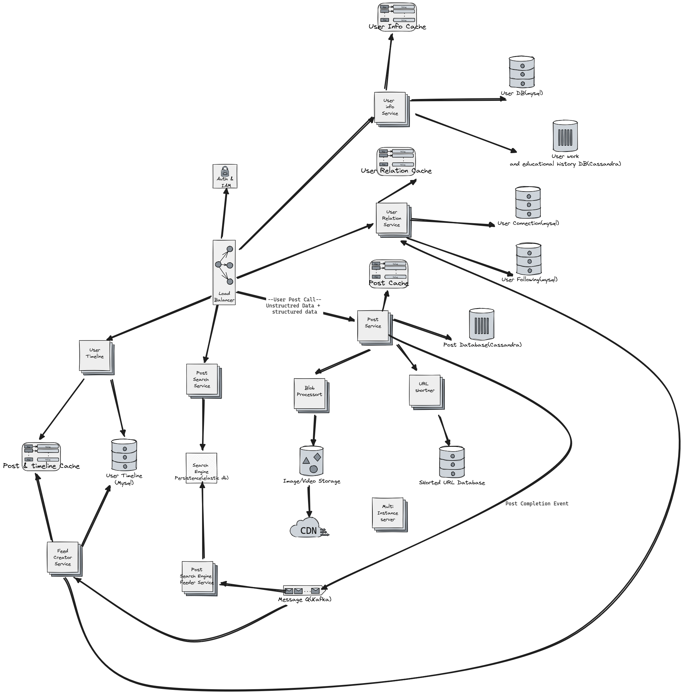

# Functional Specification.

1. There are users having profiles.
2. Users can also post content(text, video or image)
3. Users can have connections. Which is bidirectional relationship.
4. Users can also follow other users. This is directional relationshipt
5. Feed service is also required for the users.

## Non-functional Specification.
1. Availability > consitency. But eventual consistency is a must.
2. Number of users ~ 1 Bill. And 10 Mil. daily active users
3. Avg. post per user per day is 2.
4. Post per second ~ 1 Mil * 2 per day
   = 10^7 * 2 / (24 * 60 * 60) per second
   = 10^5 / (12 * 36)
   = 10^4 / 48
   = 2 * 10^2
   = 200 post per second. 

## Database entities

1. User
   a. userId(PK) 
   b. Name
   c. email
   d. contacts
   e. about.

2. Work history
   a. userId(FK)
   b. Company
   c. Designation
   d. Start Date
   e. End Date

3. Education
   a. userId
   b. Institution
   c. Degree
   d. start Date
   e. End Date

4. Connections
    a. user1
    b. user2

5. Followings
    a. Follower userId
    b. Following userid

6. Post
    a. Userid
    b. Timestamp
    c. Content(rich text)

## Services
1. User info service
2. User relation service(URS)
3. Post service
4. Feed service
5. Post Search service

## User Categories
1. Deleted users
2. Passive Users
3. Active Users
4. Famous Users

APIs
1. User Info Service
    a. Add user: POST /v1/user, BODY: <User info>
    b. Get User: GET /v1/user/userId
    c. Get User Profile: GET /v1/profile/userId
    d. add User profile: POST /v1/prfile/userId BODY:<User profile>

2. User relation Service
    a. Add Connection: POST /v1/connection/ Request param: user1, user2
    b. Get Connection list: GET /v1/connection/userId
    c. Add Follower: POST /v1/follower/userId Request param: following_user
    d. GET Followers: POST /v1/follower/userId

3. Post service
    a. Create post:
        POST /v1/post
        BODY post_data
    b. GET post: /v1/post/postId

4. Search service
    a. Search request: GET /v1/search/, body: <search string>

5. Get Feed
    a. feed request: GET /v1/feed/

# HLD Diagram

